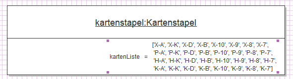

# Objekt, Attribut und Methoden

## Objekt: 
Ein Objekt ist eine autonome Software-Einheit, die für bestimmte Aufgaben zuständig ist.
Ein Objekt kann Daten mit Hilfe von Attributen verwalten und Operationen zur Verarbeitung der Verwalteten Daten mit Hilfe von Methoden ausführen

## Attribut: 
Attribute sind - an Objekt gebundene- Variablen zur Verwaltung von Daten. Diese entsprechen in der Regel den Eigenschaften der betreffenden Objekte

## Methoden: 
Methoden sind - an Objekt gebundene - Prozeduren oder Funktionen zur Verarbeitung von Daten.
Diese Methoden werden ausgeführt, wenn das betreffende Objekt veranlasst wird, eine bestimmte Option auszuführen.

## Objektzustand:
Ein Objekt befindet sich stets in einem bestimmten Zustand
Der aktuelle Objektzustand wird durch die aktuellen Werte der Attribute festgelegt
Den Zustand eines Objektes verdeutlicht man oft in einem Objektdiagramm:

## Zugriff auf Attribute und Methoden:
Attribute: `objekt.attribut`  
Methoden: `objekt.methode()`  

